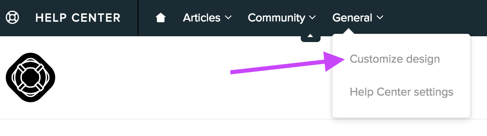
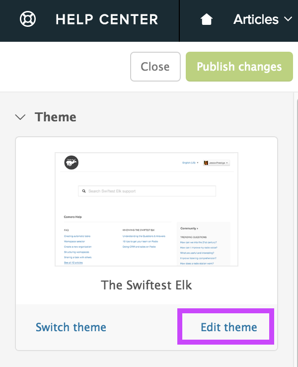
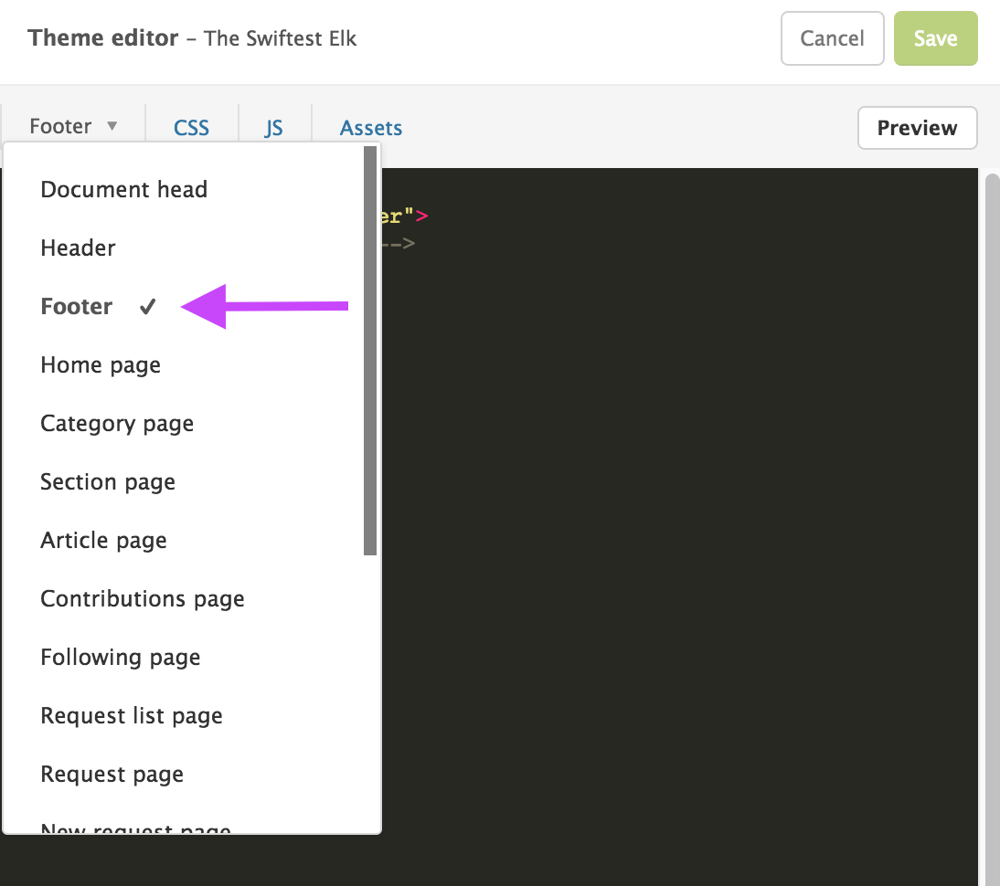
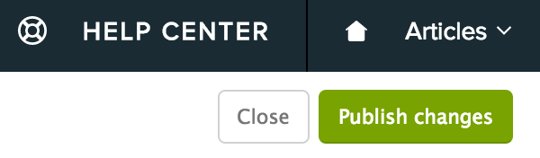

# Web Messenger FAQ

## How can I automatically open the Web Messenger on my website?

You can use the function `open()` function of the Smooch Web Messenger. Simply call this function after you initialize Smooch on your web page.

## How can I customize the texts that are displayed on the Web Messenger?

Customizing labels is easy, our [Web Messenger documentation](/guide/web-messenger/#strings-customization). You can find the list of all customizable strings on the [Web Messenger GitHub page](https://github.com/smooch/smooch-web#options)

## How can I customize the Web Messenger?

You have two ways for changing the appearance of the widget:

1. Use our built in style selector in the dashboard.
2. Fork the Web Messenger and change whatever aspects you like.

## How can I capture user's info before starting the conversation with the user on the web?

You can create a form on your website and pass us the info in `Smooch.updateUser()` after a successful call to `init()`.

## How can I reset a anonymous conversation on the web (for testing)

On the dev console, navigate to `Application tab > Local storage > your website` and clear the entries.

## How can I embed the Web Messenger in a container of my website

You can embed the Web Messenger by using this [function](/guide/web-messenger/#embedded-mode).

## The Web Messenger doesn't display well on mobile. How can I fix that?

Make sure you have this code in your HTML file:

```html
<meta name="viewport" content="width=device-width, initial-scale=1, maximum-scale=1">
```

## How can I update the user data?

You can update any information that you want on the user by using the [updateUser() method](https://github.com/smooch/smooch-web#updateuseruser)

## What URL is your CDN calling?

Here’s the list of URL we’re calling.

* `cdn.smooch.io` - Our CDN
* `*.webloader.smooch.io` - Our script loader API
* `*.config.smooch.io` - Our SDK config API
* `*.realtime.smooch.io` - Our realtime API
* `*.sdk.smooch.io` - Our API
* `netdna.bootstrapcdn.com` - Font-awesome
* `checkout.stripe.com` - For the Stripe Connect integration
* `www.gravatar.com` - Some avatars may come from here
* `telegram.me` - For the telegram integration (only during redirects)
* `mp.weixin.qq.com` - For the WeChat integration, used to pull a QR code

## Why is my profile picture not updating?

Did you enable "Use app icon and a single team name for all messages” on the dashboard?  

If you did, the image may be persisted in your cache. Refresh it and try again.

## How can I add a feature to your web messenger?

Our Web Messenger is open-source, you can contribute on [github](https://github.com/smooch/smooch-web).

## Nothing shows up when I add Smooch script?

There’s a couple of quick checks that you can do if our script doesn’t load:

1. Make sure you separate the 2 scripts we provide
2. Make sure your app ID doesn’t contain “copy”

If that doesn’t do the trick, note that there are a couple of libraries we conflict with currently: mootools, requirejs & Prototype js. Make sure that you’re not using one of them.

## How can I insert your widget in a container?

You can embed Smooch anywhere on your webpage now by following the instructions of the docs.

## Do I need a mobile app to use Smooch?

No, you don't necessarily need an app to use Smooch. You can use our Web Messenger on your website or integrate with any popular messaging app(Facebook Messenger, WeChat…).  Your team can answer your customers through different business tools like Slack, HipChat, HelpScout or Zendesk.

## How do I disable the sound notifications?

You can follow these [instructions](/guide/web-messenger/#sound-notification) to disable the sound notifications.

## How can I notify my customers that the office is closed and nobody is around to answer?

Our [office hours](/guide/office-hours/) feature makes this a breeze.

## Can I put the Web Messenger on two different websites, and also change the header?

Yes, you can place the web chat on as many sites as you like. To change the header, just set a different `introductionText` property in your init call on each site.

## How do I integrate Smooch Web Messenger with...

### Google Tag Manager

You can load Smooch's web widget through [Google Tag Manager](https://www.google.com/analytics/tag-manager/). Simply connect to your Google Tag Manager account, go inside your container and follow the guide below.

#### 1. Create a new Tag and give it a cute name like "Smooch"

On your Google Tag Manager dashboard, create a new tag and rename it "Smooch".


#### 2. Select "Custom HTML Tag"

At the end of the product list, click on "Customer HTML Tag" and continue.


#### 3. Paste Smooch's code snipet

Paste the code below in the suggested text field. Make sure to replace `<app-id>` with your Smooch app ID.

```html
<script>
    !function(e,n,t,r){
        function o(){try{var e;if((e="string"==typeof this.response?JSON.parse(this.response):this.response).url){var t=n.getElementsByTagName("script")[0],r=n.createElement("script");r.async=!0,r.src=e.url,t.parentNode.insertBefore(r,t)}}catch(e){}}var s,p,a,i=[],c=[];e[t]={init:function(){s=arguments;var e={then:function(n){return c.push({type:"t",next:n}),e},catch:function(n){return c.push({type:"c",next:n}),e}};return e},on:function(){i.push(arguments)},render:function(){p=arguments},destroy:function(){a=arguments}},e.__onWebMessengerHostReady__=function(n){if(delete e.__onWebMessengerHostReady__,e[t]=n,s)for(var r=n.init.apply(n,s),o=0;o<c.length;o++){var u=c[o];r="t"===u.type?r.then(u.next):r.catch(u.next)}p&&n.render.apply(n,p),a&&n.destroy.apply(n,a);for(o=0;o<i.length;o++)n.on.apply(n,i[o])};var u=new XMLHttpRequest;u.addEventListener("load",o),u.open("GET","https://"+r+".webloader.smooch.io/",!0),u.responseType="json",u.send()
    }(window,document,"Smooch","<app-id>");
</script>
<script>
    Smooch.init({ appId: '<app-id>'});
</script>
```

#### 4. Select to Fire On "All Pages"

Choose the trigger "All Pages" to fire the initialization of our widget when the page loads.


#### 5. Save Tag and Publish

You're almost there. Save your Tag and don't forget to publish your changes. You might need to clear the recent the cache and reload your web page to see the widget.

### Wordpress

To install Smooch on your Wordpress site, you need to [download our Web Messenger](https://github.com/smooch/smooch-wordpress) and install it through Wordpress.

1. Download the ZIP from our [Web Messenger github page](https://github.com/smooch/smooch-wordpress)
2. Connect on your Wordpress dashboard and go on the Web Messenger section
3. Click on "Add New" and then "Upload Plugin"

	

4. Choose the plugin and click on "Install Now".
5. In your Wordpress settings, click on "Smooch". Paste your app ID in the appropriate text field.

	

### Ghost

You are wondering how to load our widget on your Ghost blog. First connect to your Ghost dashboard (your-website.com/ghost). Go to the Code Injection menu (on the navigation left bar).

In the Blog Footer section, paste our initialization code and replace `<app-id>` with your Smooch app ID.

```html
<script>
    !function(e,n,t,r){
        function o(){try{var e;if((e="string"==typeof this.response?JSON.parse(this.response):this.response).url){var t=n.getElementsByTagName("script")[0],r=n.createElement("script");r.async=!0,r.src=e.url,t.parentNode.insertBefore(r,t)}}catch(e){}}var s,p,a,i=[],c=[];e[t]={init:function(){s=arguments;var e={then:function(n){return c.push({type:"t",next:n}),e},catch:function(n){return c.push({type:"c",next:n}),e}};return e},on:function(){i.push(arguments)},render:function(){p=arguments},destroy:function(){a=arguments}},e.__onWebMessengerHostReady__=function(n){if(delete e.__onWebMessengerHostReady__,e[t]=n,s)for(var r=n.init.apply(n,s),o=0;o<c.length;o++){var u=c[o];r="t"===u.type?r.then(u.next):r.catch(u.next)}p&&n.render.apply(n,p),a&&n.destroy.apply(n,a);for(o=0;o<i.length;o++)n.on.apply(n,i[o])};var u=new XMLHttpRequest;u.addEventListener("load",o),u.open("GET","https://"+r+".webloader.smooch.io/",!0),u.responseType="json",u.send()
    }(window,document,"Smooch","<app-id>");
</script>
<script>
    Smooch.init({ appId: '<app-id>'});
</script>
```

And don't forget to click on Save!

### Zendesk Help Center

Zendesk Help Center is a self-service support software that provides a knowledge base for your team and customers.

Follow the instructions below to add Smooch into your Zendesk Help Center:

#### 1. Connect to your Help Center dashboard and customize your theme

On your Zendesk Help Center dashboard, click on the "General" menu and then "Customize design".



#### 2. Add Smooch javascript code to the footer of your theme

On the newly displayed sidebar, click on "edit theme".



Then, on the theme edition dashboard, select "footer" on the first dropdown menu.



Paste the code provided below just before the ending footer tag.

```html
<script>
    !function(e,n,t,r){
        function o(){try{var e;if((e="string"==typeof this.response?JSON.parse(this.response):this.response).url){var t=n.getElementsByTagName("script")[0],r=n.createElement("script");r.async=!0,r.src=e.url,t.parentNode.insertBefore(r,t)}}catch(e){}}var s,p,a,i=[],c=[];e[t]={init:function(){s=arguments;var e={then:function(n){return c.push({type:"t",next:n}),e},catch:function(n){return c.push({type:"c",next:n}),e}};return e},on:function(){i.push(arguments)},render:function(){p=arguments},destroy:function(){a=arguments}},e.__onWebMessengerHostReady__=function(n){if(delete e.__onWebMessengerHostReady__,e[t]=n,s)for(var r=n.init.apply(n,s),o=0;o<c.length;o++){var u=c[o];r="t"===u.type?r.then(u.next):r.catch(u.next)}p&&n.render.apply(n,p),a&&n.destroy.apply(n,a);for(o=0;o<i.length;o++)n.on.apply(n,i[o])};var u=new XMLHttpRequest;u.addEventListener("load",o),u.open("GET","https://"+r+".webloader.smooch.io/",!0),u.responseType="json",u.send()
    }(window,document,"Smooch","<app-id>");
</script>
<script>
    Smooch.init({ appId: '<app-id>'});
</script>
```

#### 3. Save and publish!

Click save and don't forget to publish your work.


